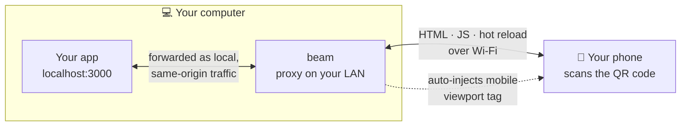

# beam

View whatever is running on localhost on your actual phone — instantly.

You're building a UI on `localhost:3000`. Your phone can't open `localhost`,
because on the phone that means the phone itself. **beam** fixes the gap: it
puts a tiny proxy on your machine's LAN address, prints a QR code, and your
phone (on the same Wi-Fi) is looking at your app seconds later.

Built for rapid prototyping of mobile-optimized designs.



## Quick start

```sh
npx beam-app          # no install — scans common dev ports and beams what it finds
npx beam-app 5173     # or point it at a specific port
```

Or install it globally to get the `beam` command:

```sh
npm install -g beam-app
beam
```

From source:

```sh
git clone https://github.com/oluwatobiwilliams/beam-app.git
cd beam-app && npm install && npm link
```

Then:

- **Phone** — scan the QR code printed in the terminal (phone must be on the
  same Wi-Fi network as this machine).
- **Desktop** — open the printed `/__beam` URL for a phone-frame preview with
  device presets (iPhone, Pixel, iPad…), rotate, and reload.

## Options

| Flag | What it does |
| --- | --- |
| `beam <port>` | Beam a specific localhost port instead of scanning |
| `-p, --port <port>` | Port beam listens on (default `8790`; auto-increments if busy) |
| `-d, --debug` | Inject [eruda](https://github.com/liriliri/eruda), a devtools console that runs on the phone (console, network, elements). Loaded from a CDN, so the phone needs internet |
| `-h, --help` | Help |

## What it does under the hood

- **LAN proxy** — listens on `0.0.0.0` and forwards every request to your app
  on `127.0.0.1:<port>`, so it works even when your dev server only binds to
  localhost. WebSockets are forwarded too, so Vite/Next HMR and live reload
  keep working on the phone.
- **Same-origin disguise** — `Host`, `Origin`, and `Referer` are rewritten so
  the dev server sees local same-origin traffic. Without this, Next.js 15+
  returns 403 for `/_next/*` client chunks from unlisted origins
  (`allowedDevOrigins`) — the page renders but never hydrates, so client
  components (theme toggles, live data) silently do nothing on the phone.
  Server Actions' Origin-vs-Host check passes for the same reason.
- **Viewport injection** — if a page has no `<meta name="viewport">`, beam adds
  one. Desktop-first prototypes otherwise render as a tiny zoomed-out page on
  phones.
- **Port detection** — probes common dev ports (3000, 5173, 8080, 4200, …)
  with a real HTTP request; if several apps are running it asks which one.
- **Friendly failure** — if your dev server dies, the phone gets a clear
  "restart your dev server" page instead of a hung connection.

## Limitations / notes

- Phone and laptop must be on the same network (or the phone connects to the
  laptop's hotspot). Corporate/guest Wi-Fi with client isolation will block it.
- HTTPS-only features (camera, some service workers) won't work over plain
  HTTP on the LAN — a future `--tunnel` flag could add an HTTPS tunnel.
- beam strips `X-Frame-Options` in dev so the `/__beam` preview iframe works.

## License

[MIT](LICENSE) — free for anyone to install, use, modify, and redistribute.

## Ideas for v2

- `--tunnel` for HTTPS + off-network access
- QR code rendered on the `/__beam` page as well as the terminal
- Scroll/click sync between desktop preview and phone
- Screenshot capture from the device frame
